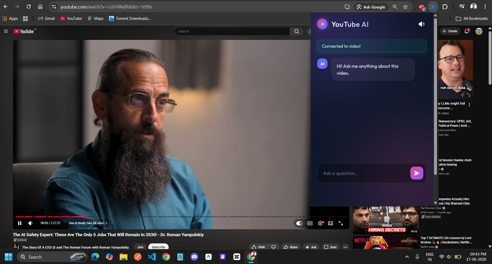

# Youtube-Chatbot
An intelligent YouTube Chatbot built with LangChain. It uses Retrieval-Augmented Generation (RAG) to query video transcripts, answer user questions, and generate concise summaries in real-time. Features an interactive UI, seamless YouTube API integration, and advanced conversational memory for highly contextual, accurate video insights.

